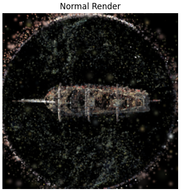
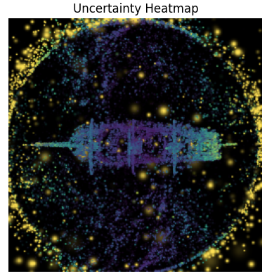

# Uncertainty-Aware 3D Gaussian Splatting (3DGS)

**Per-splat uncertainty from multi-view visibility dispersion** — a light, reproducible diagnostic on top of a pretrained 3DGS `.ply` scene. No retraining required; runs on free Colab/T4.

> 📄 Write-up: [`docs/UncertainityAwareGS.pdf`](docs/UncertainityAwareGS.pdf)

---

## Idea (one paragraph)

Render contributions for each Gaussian across an **orbit of cameras**, compute a **per-view visibility score** (opacity × screen-space footprint ÷ depth²), then take the **cross-view standard deviation** as an uncertainty signal. Stable, consistently visible splats have low variance; flickery / peripheral / depth-unstable splats have high variance. We visualize an **uncertainty heatmap** and can export normal vs. heatmap orbits as GIFs. (See implementation details in the notebook and PDF.) :contentReference[oaicite:3]{index=3} :contentReference[oaicite:4]{index=4}

---

## Features

- **Per-splat uncertainty** from cross-view dispersion (std over orbit)  
- **Colab-friendly**: loads `.ply`, subsamples to ~40k splats, 256×256 renders  
- **Outputs**: normal RGB render, **uncertainty heatmap**, optional orbit GIFs  
- **Zero retraining**; works with any pretrained 3DGS scene you have on disk :contentReference[oaicite:5]{index=5}

---

## Quickstart (Colab)

This project was developed in **Google Colab**.

**Dependencies** (installed in-notebook): `plyfile`, `torch`, `numpy`, `matplotlib`, `tqdm`, `imageio`

**Run in Colab**:
1. Mount Drive and set `PLY_PATH` to your scene’s `.ply`.  
2. Adjust image size and `MAX_N` if needed.  
3. Run all cells to produce:
   - one **normal** render
   - one **uncertainty heatmap** render
   - optional **orbit GIFs** (normal + heatmap)

See the Colab code for full pipeline (camera orbit, projection, visibility score, uncertainty, rendering). :contentReference[oaicite:6]{index=6}

---

## Script usage (local/Colab)

The script version mirrors the notebook flow:

code/uncertainityawaregs.ipynb

Key steps inside:
- Load `.ply` → tensors for positions, SH DC colors (sigmoid), opacity logits (sigmoid → α), log-scales (exp), rot quats.
- Build pinhole intrinsics, `look_at` poses for an azimuth orbit (12–24 views).
- Per view: project, estimate pixel radius from scale & depth, compute visibility score.
- Uncertainty = std over views; percentile-normalize to [0,1]; color with Viridis.
- Render **normal** and **heatmap** images; optionally export orbit GIFs. :contentReference[oaicite:7]{index=7}

> Tip: Keep `n_views` modest (e.g., 12–24) to balance stability and runtime. Use `MAX_N` to subsample splats if memory is tight. :contentReference[oaicite:8]{index=8}

---

## Results (sample)

| View | Normal render | Uncertainty heatmap |
|---|---|---|
| Example |  |  |

Uncertainty emphasizes splats at **scene peripheries, thin structures, and depth-unstable regions**; confident geometry stays low. (See PDF for summary statistics—min/mean/max; robust percentiles and visual comparisons.) :contentReference[oaicite:9]{index=9}

---

## Method sketch

For each splat *i* and view *v*, define a visibility proxy  
*sᵢ^(v) = αᵢ · (rᵢ² / zᵢ²)*, where α is opacity, *r* is screen-space radius, *z* is depth.  
Uncertainty *uᵢ = std_v(sᵢ^(v))*; percentile-clip and colorize for visualization. :contentReference[oaicite:10]{index=10}

---

## Project structure

uncertainty-aware-3dgs/
├─ code/
│ └─ uncertainityawaregs.py
├─ docs/
│ ├─ UncertainityAwareGS.pdf
│ ├─ assets/
│ │ ├─ normal.png
│ │ ├─ uncertainty.png
│ │ ├─ rd_example.png
│ │ └─ demo.mp4
└─ README.md

---

## Limitations & next steps

- Heuristic visibility proxy; not a calibrated probabilistic confidence.  
- Orbit density trades runtime vs. stability; anisotropy not yet visualized.  
- Next: Bayesian/variational uncertainty; semantics-aware maps; extend to **4DGS**. :contentReference[oaicite:11]{index=11}

---

## License

MIT
